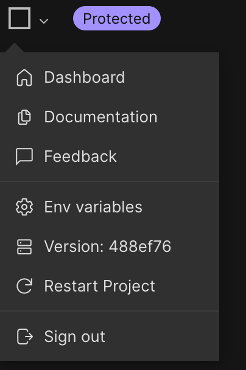
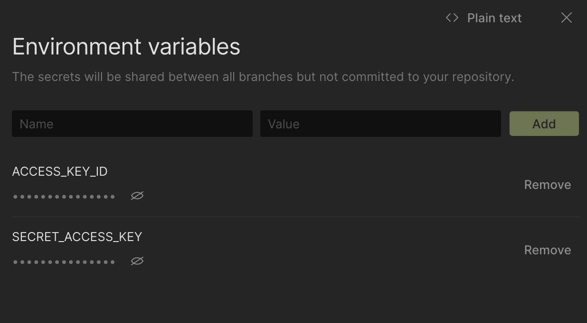
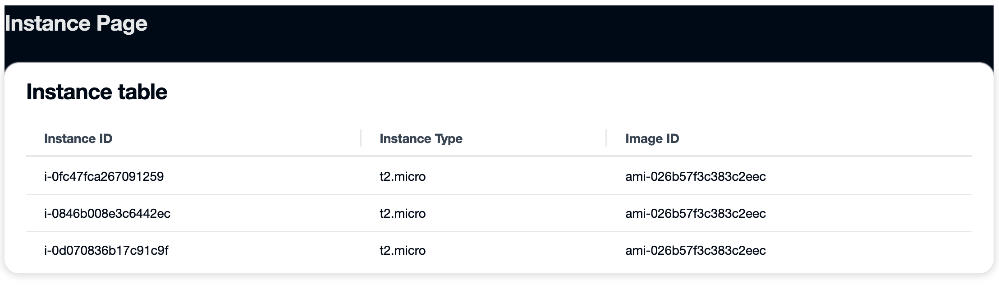

## Deploying a NextJS SSR Application to Amplify

In this blog post, we will look how we can deploy a [NextJS](https://nextjs.org/learn/foundations/about-nextjs/what-is-nextjs) web application from GitHub directly to [AWS Amplify](https://aws.amazon.com/amplify/). We will also be using [CodeSandbox](https://codesandbox.io/docs/overview) to work with the code before deploying.

### Working with CodeSandbox

After creating the GitHub repo, we will [import the code](https://codesandbox.io/docs/importing#import-from-github) into a [CodeSandbox project](https://codesandbox.io/p/github/schuettc/nextjs-ssr-with-amplify-deploy/main?file=%2FREADME.md). This will allow us to work with and explore the code before deploying to our Amplify App.

### Creating AWS Credentials

Because this demo will use an [AWS SDK](https://aws.amazon.com/sdk-for-javascript/) request, we will need to configure credentials that include this request. In order to do this, we will be creating a [User](https://docs.aws.amazon.com/IAM/latest/UserGuide/id_users_create.html) and assigning them a [Role](https://docs.aws.amazon.com/IAM/latest/UserGuide/id_roles.html). This Role should be limited in scope to only the Action that is required.

```json
{
  "Version": "2012-10-17",
  "Statement": [
    {
      "Sid": "DescribeInstances",
      "Effect": "Allow",
      "Action": "ec2:DescribeInstances",
      "Resource": "*"
    }
  ]
}
```

When the User is created, you will get an AWS_ACCESS_KEY_ID and AWS_SECRET_ACCESS_KEY. We will be using these to configure our application so that it has permissions to `DescribeInstances`.

### Adding AWS Credentials

After the AWS Credentials have been created, they must be added to the application. To do this, we will use [Environment Variables](https://codesandbox.io/docs/secrets) in our CodeSandbox container. When forking this container, these environment variables will not be copied, so you must use your own.





### Using the AWS SDK with Credentials

After configuring the Environment Variables, we can use the AWS SDK in the [pages/api/instances.js](https://github.com/schuettc/nextjs-ssr-with-amplify-deploy/blob/main/pages/api/instances.js) file.

```javascript
import { EC2Client, DescribeInstancesCommand } from '@aws-sdk/client-ec2';
const config = {
  region: 'us-east-1',
  credentials: {
    accessKeyId: process.env.ACCESS_KEY_ID,
    secretAccessKey: process.env.SECRET_ACCESS_KEY,
  },
};

const client = new EC2Client(config);
```

### Result

Now that we have our API configured with credentials, when the front end application uses this API, we will query the associated account for active instances in `us-east-1` and display them on a simple page.



### Deploying in AWS Amplify

[](https://console.aws.amazon.com/amplify/home#/deploy?repo=https://github.com/schuettc/nextjs-ssr-with-amplify-deploy)
