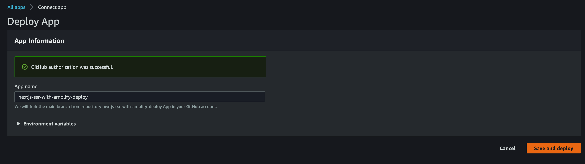
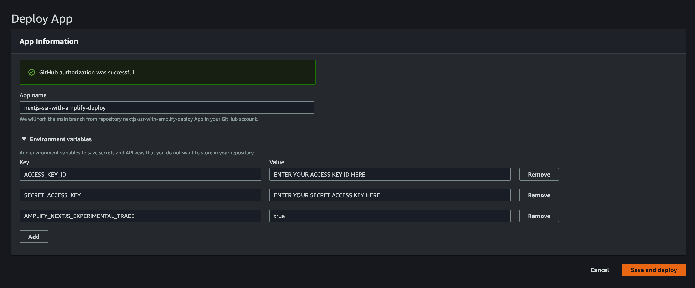
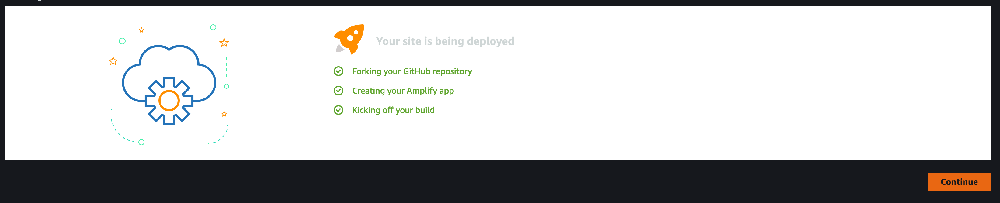
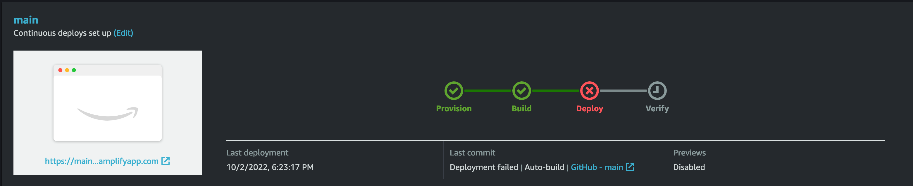
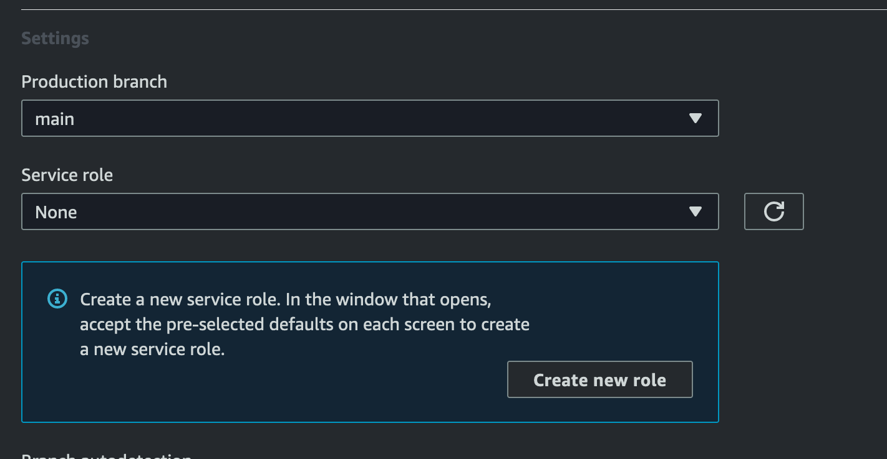
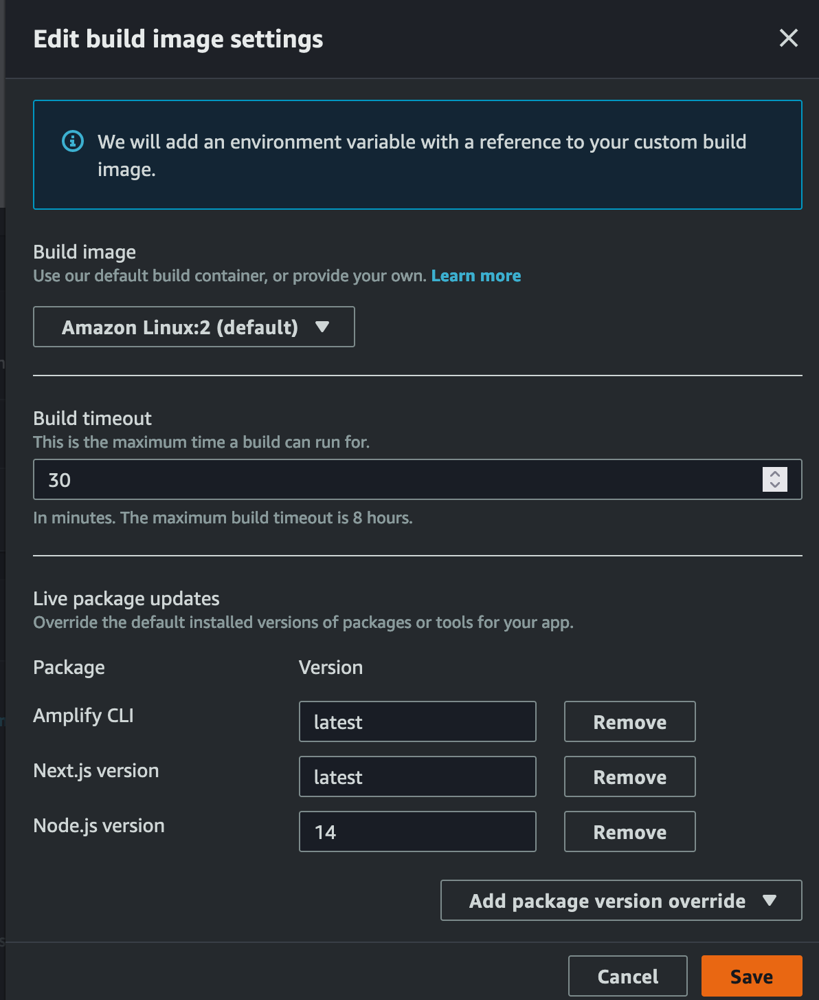
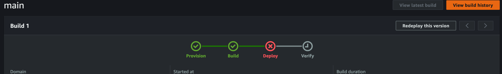
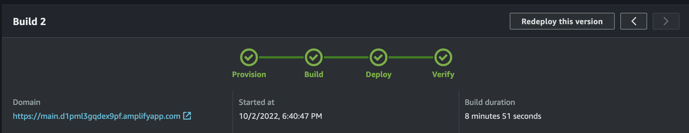

## Deploying a NextJS SSR Application to Amplify

In this blog post, we will look how we can deploy a [NextJS](https://nextjs.org/learn/foundations/about-nextjs/what-is-nextjs) web application from GitHub directly to [AWS Amplify](https://aws.amazon.com/amplify/). We will also be using [CodeSandbox](https://codesandbox.io/docs/overview) to work with the code before deploying.

### Working with CodeSandbox

After creating the GitHub repo, we will [import the code](https://codesandbox.io/docs/importing#import-from-github) into a [CodeSandbox project](https://codesandbox.io/p/github/schuettc/nextjs-ssr-with-amplify-deploy/main?file=%2FREADME.md). This will allow us to work with and explore the code before deploying to our Amplify App.

### Creating AWS Credentials

Because this demo will use an [AWS SDK](https://aws.amazon.com/sdk-for-javascript/) request, we will need to configure credentials that include this request. In order to do this, we will be creating a [User](https://docs.aws.amazon.com/IAM/latest/UserGuide/id_users_create.html) and assigning them a [Role](https://docs.aws.amazon.com/IAM/latest/UserGuide/id_roles.html). This Role should be limited in scope to only the Action that is required.

```json
{
  "Version": "2012-10-17",
  "Statement": [
    {
      "Sid": "DescribeInstances",
      "Effect": "Allow",
      "Action": "ec2:DescribeInstances",
      "Resource": "*"
    }
  ]
}
```

When the User is created, you will get an AWS_ACCESS_KEY_ID and AWS_SECRET_ACCESS_KEY. We will be using these to configure our application so that it has permissions to `DescribeInstances`.

### Adding AWS Credentials

After the AWS Credentials have been created, they must be added to the application. To do this, we will use [Environment Variables](https://codesandbox.io/docs/secrets) in our CodeSandbox container. When forking this container, these environment variables will not be copied, so you must use your own.


### Using the AWS SDK with Credentials

After configuring the Environment Variables, we can use the AWS SDK in the [pages/api/instances.js](https://github.com/schuettc/nextjs-ssr-with-amplify-deploy/blob/main/pages/api/instances.js) file.

```javascript
import { EC2Client, DescribeInstancesCommand } from '@aws-sdk/client-ec2';
const config = {
  region: 'us-east-1',
  credentials: {
    accessKeyId: process.env.ACCESS_KEY_ID,
    secretAccessKey: process.env.SECRET_ACCESS_KEY,
  },
};

const client = new EC2Client(config);
```

### next.config.js

To pass these [Environment Variables to Amplify](https://docs.aws.amazon.com/amplify/latest/userguide/server-side-rendering-amplify.html#ssr-environment-variable-support), we need to modify the next.config.js file.

```javascript
const withTranspileModules = require('next-transpile-modules');
const withPlugins = require('next-compose-plugins');

module.exports = withPlugins(
  [withTranspileModules(['@cloudscape-design/components'])],
  {
    env: {
      ACCESS_KEY_ID: process.env.ACCESS_KEY_ID,
      SECRET_ACCESS_KEY: process.env.SECRET_ACCESS_KEY,
    },
  },
);
```

### amplify.yml

To configure the build of the Amplify application, we include `amplify.yml` and instruct it to use Node version 16 as part of the build.

```yaml
version: 1
frontend:
  phases:
    preBuild:
      commands:
        - nvm use $VERSION_NODE_16
        - npm ci
    build:
      commands:
        - nvm use $VERSION_NODE_16
        - npm run build
  artifacts:
    baseDirectory: .next
    files:
      - '**/*'
  cache:
    paths:
      - node_modules/**/*
```

### Result

Now that we have our API configured with credentials, when the front end application uses this API, we will query the associated account for active instances in `us-east-1` and display them on a simple page.


### Deploying in AWS Amplify

In order to deploy to AWS Amplify, you will need to use the GitHub Apps feature to [authorize Amplify](https://docs.aws.amazon.com/amplify/latest/userguide/setting-up-GitHub-access.html) to read your GitHub repository.

[](https://console.aws.amazon.com/amplify/home#/deploy?repo=https://github.com/schuettc/nextjs-ssr-with-amplify-deploy)

#### Begin Deploy

After clicking, you will begin the process of deploying to Amplify.



#### Add Environment Variables

At the next screen, you will be able to add Environment Variables. Please not the additional Environment Variable needed in addition to your Access Key ID and Secret Access Key:

`AMPLIFY_NEXTJS_EXPERIMENTAL_TRACE` = `true`



#### Deploying

Once added, the App will being deploying.


#### Deploy Failure

This should result in a failure to deploy that we will be fixing.



### Finalizing Amplify Configuration

In order to deploy a SSR Application, we must add appropriate Service Role permissions. That will correct this error:

```text
 Cannot find any generated SSR resources to deploy. If you intend for your app to be SSR, please check your app Service Role permissions. Otherwise, please check out our docs on how to setup your app to be detected as SSG (https://docs.aws.amazon.com/amplify/latest/userguide/server-side-rendering-amplify.html#deploy-nextjs-app)
```

#### Add Service Role

In the App settings, select General and Edit. If there is no available Service role, you will need to create a new service role.



Follow the prompts to create a new Service Role and then assign in the Amplify App settings then Save.

#### Update Build Settings

Additionally, you should configure the Build image settings. In the App settings, select Build settings and Edit. Set the Next.js version to `latest` and the Node.js version to `14`. This will ensure the AWS Lambdas that are created as part of this application use Node version 14.



#### Redeploy

Return to your App and select `Redeploy this version`



#### Success!

Your app should now successfully deploy and can be accessed at the Domain shown in the console.


